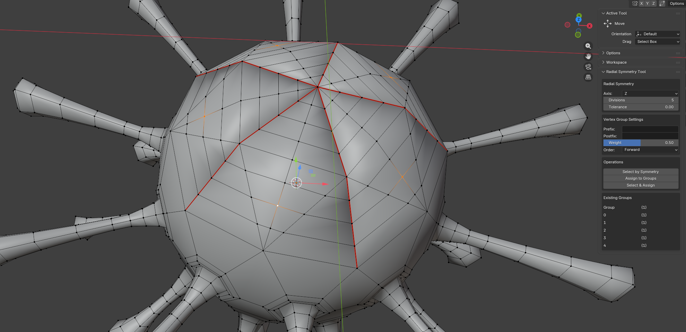

# Blender Scripts

Advanced mesh editing tool for Blender 5.x.

*Created with AI-Monkey 🐵🤖*

## Addon

### Radial Symmetry Tool (v0.1.0)
**Advanced tool for radial symmetry operations and batch vertex group assignment**

Useful for octopus-like bones binding and may be for other things.

#### Features:
- **Select by Symmetry** — select vertices with radial symmetry around a chosen axis
- **Assign to Groups** — divide selected vertices and assign them to named vertex groups
- **Select & Assign** — combined operation of selection and assignment in one action

#### Parameters:
- **Radial Symmetry**
  - Axis — rotation axis (X, Y, Z)
  - Divisions — number of equal divisions
  - Tolerance — tolerance for finding corresponding vertices

- **Vertex Group Settings**
  - Prefix — prefix for group names
  - Postfix — suffix for group names
  - Weight — influence weight of vertex on group (0.0 - 1.0)
  - Order — processing direction (Forward/Reverse)

#### Usage:
1. Select a mesh in Edit Mode
2. Select one or more vertices
3. Set parameters in the tool panel
4. Press the desired operation button

## Installation

1. Copy `radial_symmetry_tool.py` to your Blender addons folder:
   - Windows: `C:\Users\[YourUsername]\AppData\Roaming\Blender Foundation\Blender\5.1\scripts\addons\`
   - macOS: `/Users/[YourUsername]/Library/Application Support/Blender/5.1/scripts/addons/`
   - Linux: `/home/[YourUsername]/.config/blender/5.1/scripts/addons/`

2. Open Blender → Preferences → Extensions

3. Find "Radial Symmetry Tool" and enable it

## Requirements

- Blender 5.0 or higher
- Python 3.10+

## Compatibility

✅ Tested with Blender 5.1

## Notes

- Vertex groups are created automatically when assigning
- Pre-select vertices in Edit Mode before direct assignment
- Vertex order is preserved when using "Select & Assign" operation
